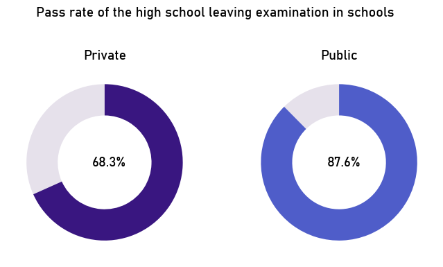

<!-- # Educational_Institutions -->

    Is there a place for SQL for school research?

  

# Abstract

The notebook is a collection of statistics based on which it is possible to conclude which educational institutions in Poland are the best. The data used in the analysis comes from <a href="https://rspo.gov.pl/institutions?q=%7B%22page%22:0,%22pageSize%22:30,%22sort%22:%22%22 ,%22direction%22:%22%22%7D">Rejestru Szkół i Placówek Oświatowych</a> and from the <a href="https://mapa.wyniki.edu.pl/MapaEgzaminow/">mapa.wyniki.edu.pl</a> run by the Ministry of National Education. The data was downloaded on April 23, 2024 (RSPO) and April 27, 2024 (high school leaving exam, eighth-grade exam). The analysis is divided into five segments - a comparison of results by type of district, private and public schools, Montessori schools and school age, and a segment devoted to the number of psychologists in schools. PostgreSQL databases and Python with additional libraries were used for the analysis. The main conclusions that can be drawn from the analysis include:
1. Urban communes and cities usually achieve higher results in state examinations compared to rural communes.
2. Private institutions usually achieve lower results compared to public institutions, although there is an exception in the form of the Matura exam in the Russian language.
3. Montessori schools achieve higher results compared to other schools, although in the case of secondary schools the results were statistically insignificant.
4. The percentage of schools employing a psychologist is 73% and the distribution of employment is uneven among rural, urban and urban communes, public and private schools and voivodeships.
5. The date of school establishment correlated with student results only in the case of secondary schools and it correlated negatively.

  

# Content

<ul>
<li>
    Comparison of results by type of commune
    <ul>
        <li>Pass rate</li>
        <li>Average scores in primary schools</li>
        <li>Average scores in high schools</li>
    </ul>
</li>
<li>
    Comparison of scores divided into private and public schools
</li>
<li>
    Comparison of scoores with Montessori schools
</li>
<li>
    Number of psychologists in schools
    <ul>
        <li>Percentage of schools employing psychologists</li>
        <li>Percentage of schools employing psychologists by type of district</li>
        <li>Percentage of schools employing psychologists, divided into public and private schools</li>
        <li>Percentage of schools employing psychologists by voivodeship</li>
    </ul>
</li>
<li>
    Comparison of scores by date of school establishment
    <ul>
        <li>Elementary schools</li>
        <li>High schools</li>
    </ul>
</li>
</ul>

  

# Example interesting statistics

    Did you know that private schools achieve lower scores in the high school leaving examination (matura) than public schools? Why? Check analysis.
      
    

